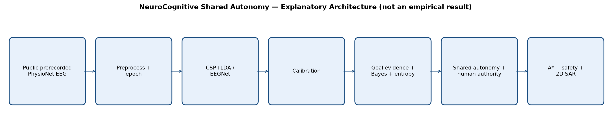
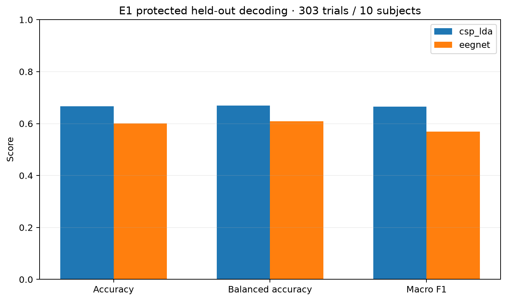

# NeuroCognitive Shared Autonomy for Search & Rescue

EEG-Based Intent Decoding with Bayesian Goal Inference and Uncertainty-Aware Adaptive Control

This repository implements a software-only research prototype that asks:

> Can uncertainty-aware shared autonomy improve the reliability and safety of EEG-based intent control compared with direct brain-computer control?

The governing principle is simple: **the human determines WHAT objective is intended; the AI determines HOW to achieve it safely.** The system uses public prerecorded PhysioNet motor-imagery EEG and an Offline EEG Replay / Simulated Real-Time BCI workflow. It does not acquire live EEG or control a physical robot.



## What is implemented

```text
PhysioNet EEGBCI runs 4/8/12
→ 7–30 Hz preprocessing, average reference, -1 s to +4 s epochs
→ CSP+LDA and EEGNet/compact CNN
→ Platt or temperature calibration
→ binary candidate evidence
→ sequential Bayesian posterior and Shannon entropy
→ PROCEED / CONFIRM / DEFER shared autonomy
→ explicit CONFIRM / OVERRIDE / PAUSE / STOP authority
→ risk-aware four-connected A*
→ hard-safety check before every transition
→ 2D Search & Rescue simulation
→ structured evaluation, robustness, ablations, and provenance
```

The decoder remains binary (Left/Right motor imagery). Each decision exposes two valid candidate objectives; calibrated Left supports candidate A and Right supports candidate B. This is not a direct multiclass rescue-goal decoder.

## Accepted final evaluation

The only accepted reportable source is `results/m7/final/m7-final-results-v5.json`. E1/E2/E8 use all 10 protected subjects and 303 retained trials. Balanced sequential E3/E4/E6/E7/E9 analyses use 8 participants and 38 fixed-intent five-observation episodes; subjects 57 and 84 remain in the protected cohort but lack balanced sequential participation.

| Decoder | Accuracy | Balanced accuracy | Macro F1 |
|---|---:|---:|---:|
| CSP+LDA | 66.7% | 66.9% | 66.5% |
| EEGNet | 60.1% | 60.9% | 56.9% |

Calibration was mixed. CSP+LDA ECE changed from 0.0495 to 0.0397 while Brier changed from 0.2219 to 0.2253. EEGNet ECE changed from 0.0732 to 0.0570 and Brier from 0.2297 to 0.2253.

In E6, task success under the frozen deterministic simulated-human policy was:

| Decoder | A Direct | B Confidence-aware | C Bayesian shared autonomy | D Full |
|---|---:|---:|---:|---:|
| CSP+LDA | 25/38 | 38/38 | 32/38 | 32/38 |
| EEGNet | 23/38 | 38/38 | 36/38 | 36/38 |

These values are not an overall ranking. Condition B's 38/38 reflects the defined simulated-human intervention policy, not zero-cost autonomy or real-human usability. C/D used roughly 4.3–4.4 accepted observations on average versus one for A/B.

D-minus-A subject-level correctness effects were 0.1563 for CSP+LDA (95% paired-bootstrap CI 0.0417–0.2813; Holm-adjusted p=0.125) and 0.3167 for EEGNet (CI 0.1667–0.4625; Holm-adjusted p=0.0625). Neither was significant after Holm correction at 0.05. Adaptation did not change aggregate success relative to C (32/38 and 36/38 respectively).



## Dashboard and deterministic demo

Install dependencies, then launch:

```powershell
python -m streamlit run src/app/dashboard.py
```

The dashboard has 14 inspection sections covering architecture, accepted EEG/calibration/system results, Bayesian uncertainty, planning/safety, robustness, subject heterogeneity, adaptation, statistics, limitations, provenance, and a deterministic end-to-end demo.

The demo fixture uses fixed explanatory probabilities and the accepted production Bayes, entropy, shared-autonomy, and A* interfaces. It is explicitly non-empirical and does not read protected EEG or create a new experiment.

Headless smoke:

```powershell
python -m src.app.dashboard --smoke
```

See [demo/README.md](demo/README.md), [demo/DEMO_SCRIPT.md](demo/DEMO_SCRIPT.md), and [demo/DEMO_STORYBOARD.md](demo/DEMO_STORYBOARD.md) for a short recorded walkthrough.

## Installation

Python 3.11+ is recommended.

```powershell
python -m venv .venv
.\.venv\Scripts\Activate.ps1
python -m pip install -r requirements.txt
```

The first real-data loader run may download EEGBCI EDF files through MNE. Do not commit raw EEG or local caches.

## Verification

```powershell
python -m pytest -q
python -m compileall src tests
python -m src.app.dashboard --smoke
python -m src.app.generate_figures
```

The M8 result loader checks the accepted result and manifest SHA-256 identities, schema, software provenance, E1–E9 presence, sample sizes, and required tables. It cannot select v1–v4 or invoke experiment execution.

## Repository layout

```text
src/eeg/          loading, preprocessing, epochs, replay
src/models/       CSP+LDA, EEGNet, calibration, runtime adapter
src/cognitive/    Bayes, uncertainty, personalization
src/control/      shared autonomy, human authority, mission bridges
src/autonomy/     2D environment, A*, safety, execution, replanning
src/evaluation/   accepted M7 experiment and reporting machinery
src/app/          read-only M8 result layer, dashboard, demo, figures
tests/            unit, integration, scientific, and presentation tests
results/m7/       immutable accepted and historical audit artifacts
results/m8/       presentation-only figures
docs/             specifications and final scientific reporting
demo/             runnable walkthrough and recording plan
```

## Reproducibility and provenance

- accepted result: `results/m7/final/m7-final-results-v5.json`
- result SHA-256: `b5c7cc2efdbbbab53c65d54aa77542a2e69a71c42d5bdc670e2fd8c34af2dd9b`
- accepted manifest: `results/m7/manifest/m7-final-execution-v6-d084-r03-final.json`
- manifest SHA-256: `f837258312adf17ec1a04079c71c5461838a4aff5096541acd993bb94da24306`
- generating software SHA: `a1a696204a8b06263efa8bb57abc610af3f7361e`
- accepted candidate/merge SHA: `61af5226e7214f5b858e6e1faec4b042d340bdd8`
- exact-ref CI: run `34840393388`, 511 passed, 16 warnings

M7 v1–v3 are preserved as invalid implementation-contract artifacts and v4 as an invalid provenance-binding artifact. They are audit history, not accepted results.

## Limitations and claim boundary

- Public prerecorded EEG, not live acquisition.
- Left-vs-Right motor imagery, not unrestricted thought decoding.
- Offline repeated-trial evidence episodes, not natural continuous control sessions.
- Deterministic simulated-human responses, not a human-subject efficacy or usability study.
- One dataset, substantial inter-subject heterogeneity, and only 8 balanced sequential participants.
- Simple 2D simulated Search & Rescue, no physical robot or real deployment.
- Simulated hard constraints, not certified real-world safety.
- Failure-taxonomy categories exist, but v5 does not aggregate category counts.
- No clinical or medical claim.

## Documentation

- [Final technical report](docs/FINAL_TECHNICAL_REPORT.md)
- [Results and analysis](docs/23_RESULTS_AND_ANALYSIS.md)
- [Discussion and findings](docs/24_DISCUSSION_AND_FINDINGS.md)
- [Experimental design](docs/17_EXPERIMENTAL_DESIGN.md)
- [Metrics](docs/18_METRICS_AND_EVALUATION.md)
- [Limitations, ethics, and validity](docs/20_LIMITATIONS_ETHICS_AND_VALIDITY.md)
- [Portfolio and resume positioning](docs/PORTFOLIO_AND_RESUME_POSITIONING.md)

## Technology

Python, MNE-Python, NumPy, pandas, scikit-learn, PyTorch, Gymnasium, Matplotlib, Streamlit, YAML, Git, and GitHub.

## Citation and responsible use

Dataset users should cite the PhysioNet EEG Motor Movement/Imagery Database and MNE-Python according to their official guidance. This repository documents an AI-assisted, human-directed implementation. Conclusions apply only to the frozen offline protocol and simulated environment described above.
